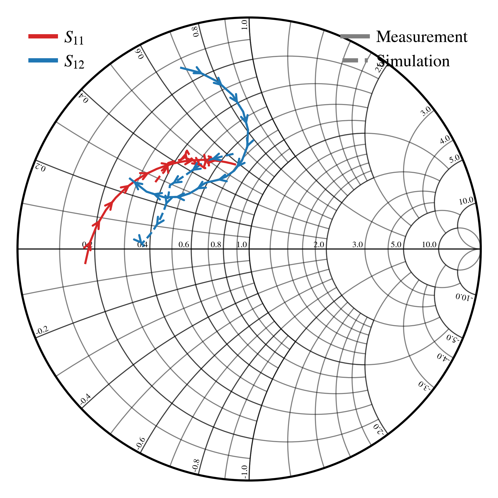

# mrgtools
mrgtools is a collection of useful utilities for common tasks. 

# Python
For Python utilities, you may need to add the mrgutils/python folder to your system path in order for python to recognize the files. You can also use sys.path.append before importing any modules. 

# python/inst.py
A Python library for controlling instruments over GPIB and USB using SCPI commands. 

The specific functions for each instrument are unqiue. However, most instruments follow something like this:

```python
import inst

# Example of initializing an instance of the library to control the noise figure meter. 
# Replace NoiseFigure_8970B with the class name of the instrument of your choice, 
# and the address with the isntrument address. 
nfm = inst.NoiseFigure_8970B('GPIB0::8::INSTR')
```


# python/jdsmith.py
An improved smith chart plotting utility for use with Python and Matplotlib. 

jdsmith ueses pyplot.plot internally for its plot commands. Any extra commands that would normally work with pyplot.plot work for jdsmith.plot (e.g. setting line color, width, style etc...).

Additional grid lines, or denser grids can be added by adjusting the code in the init function. 

A more complex example using the smith charting tool is shown below. 

```python
from matplotlib import pyplot
import jdsmith
import skrf

# create a new figure with axis of size 3.5"x2"
# note that if this figure is saved as a pdf, and used in Latex the figure will appear as 3.5x2 inches on the page (if the width is not set)
fig, ax = pyplot.subplots(figsize=(3.5, 2))

# call the library to create a smith chart on the desired axis
# this call returns an instance of the class which contains the other plotting functions
smith = jdsmith.jdsmith(ax, fontsize=4)

# setup the bounds on the smith chart
# the smith chart is plotted on a typical cartesian axis where both x and y axis span [-1, 1]
# this code sets the plot to just show roughly the top left quadrant of the chart
# ax.set_ylim(-0.01, 1.01)
# ax.set_xlim(-1.01, 0.2)

# this code here imports s-parameter files for plotting
# this requires scikit-rf 
gammaL_calc = skrf.Network('./GammaL_SAV_551+.s1p')
gammaOpt_calc = skrf.Network('./GammaOpt_SAV_551+.s1p')
gammaL_realized_sim = skrf.Network('./GammaL_SAV_551+_Meas.s2p')
gammaOpt_realized_sim = skrf.Network('./GammaOpt_SAV_551+_Meas.s2p')

# any array of complex values can be plotted using smith.plot
# here the s parameters created by skrf are plotted (.s[:, 0, 0] plots all S11 values across frequency)
smith.plot(gammaL_calc.s[:, 0, 0], label=r'$\Gamma_L$ Target', linewidth=1, arrowscale=8, linestyle='--', color='tab:red')
smith.plot(gammaL_realized_sim.s[:, 0, 0], label=r'$\Gamma_L$ Realized', linewidth=1, arrowscale=8, color='tab:red')
smith.plot(gammaOpt_calc.s[:, 0, 0], label=r'$\Gamma_{opt}$ Target', linewidth=1, arrowscale=8, linestyle='--', color='tab:blue')
smith.plot(gammaOpt_realized_sim.s[:, 0, 0], label=r'$\Gamma_{opt}$ Realized', linewidth=1, arrowscale=8, color='tab:blue')

# custom legend stuff
# this creates two independently movable legends
legend_lines = [
    pyplot.Line2D([0],[0], color='tab:grey', linestyle='solid', lw=2),
    pyplot.Line2D([0],[0], color='tab:grey', linestyle='--',    lw=2)
]

legend_colors = [ 
    pyplot.Line2D([0],[0], color='tab:red', linestyle='solid',    lw=2),
    pyplot.Line2D([0],[0], color='tab:blue', linestyle='solid',   lw=2)
]

legend_type = pyplot.legend(legend_lines, ['Measurement','Simulation'], loc='upper right', bbox_to_anchor=(1, 1), ncols=1)
legend_traces = pyplot.legend(legend_colors, ['$S_{11}$', '$S_{12}$', '$S_{21}$', '$S_{21}$'], loc='upper left', bbox_to_anchor=(0, 1), ncols=1)  

ax.add_artist(legend_type)
ax.add_artist(legend_traces)

# optinally, save the figure to file 
# fig.savefig('smithchart.pdf', format='pdf', dpi=600)
fig.tight_layout()
pyplot.show()

```



# matlab/char_impedance_microstrip.m
Calculates characteristic impedance of a microstrip line. 
